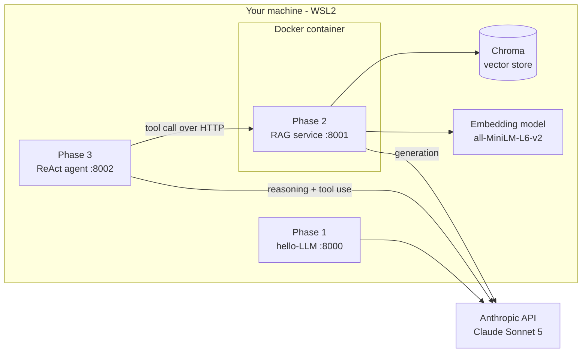
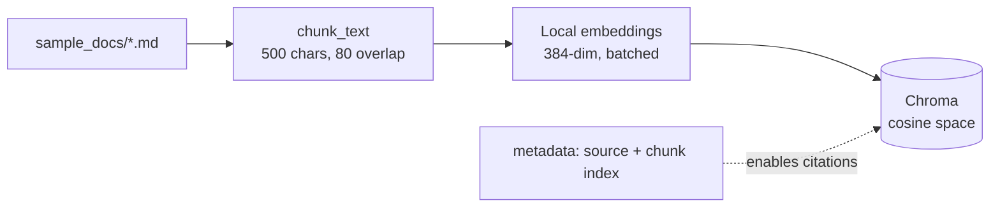
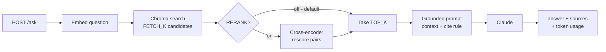
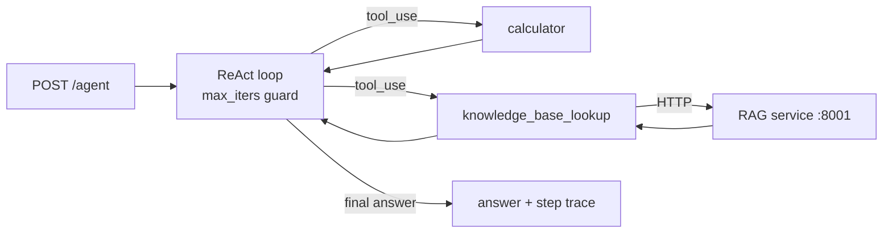
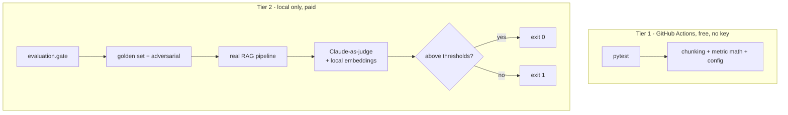
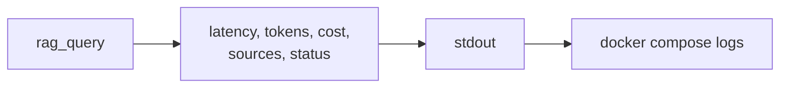

# Architecture

Three services built across four phases. One design principle throughout:
**keep data local, and measure everything.** Only the generation call leaves the
machine - chunking, embeddings, vector search and reranking all run locally.

---

## 1. System context

The agent treats the RAG service as just another tool - a clean service
boundary, and the reason Phase 2 and Phase 3 compose instead of merging.

---

## 2. Ingest pipeline

Run once per corpus change: `python ingest.py`

Overlap exists so a fact is never split across a chunk boundary. The `source`
metadata is what lets answers cite the file they came from.

---

## 3. Query path

Two-stage retrieval: the bi-encoder is fast but approximate, the cross-encoder is
slower but sharper. Reranking is **off by default** - measured on this corpus and
it produced no lift, because the first stage was already near-ceiling. It stays
in the code for when the corpus grows noisier.

---

## 4. Agent orchestration

reason -> act -> observe, until the model answers or `MAX_ITERS` trips. Tool
failures return error **strings**, so the model can recover on the next turn
rather than crashing the loop.

---

## 5. Evaluation - two tiers

Deterministic failures are caught free on every push. The expensive quality check
stays local and deliberate, so the API key never reaches a third-party runner.

Metrics: faithfulness, answer relevancy, context precision, context recall,
answer correctness, abstention rate. Thresholds sit just below measured baseline
so ordinary judge noise does not raise false alarms.

---

## 6. Observability

Every call emits one JSON line to stdout - container-friendly, no agent needed.

Measured on this system: **cold start ~6.5s** (model load into RAM), **warm ~2s**
(dominated by the Claude call). That gap is why this workload wants a warm,
long-running container rather than scale-to-zero serverless.

Each line records the pricing rates used, so historical cost estimates stay
interpretable after rates change.

---

## Design decisions worth defending

| Decision | Why |
|---|---|
| Local embeddings, not an embeddings API | Document text never leaves the machine |
| Chroma over pgvector | Free, local, zero-ops for this scale; pgvector is the upgrade path |
| Reranking built then disabled | Measured no lift on a small clean corpus - kept for when it changes |
| Chunk 500 / TOP_K 2 | Swept with repeats: chunk size was the dominant lever on faithfulness |
| Structured logs, not Langfuse cloud | Cloud tracing would send prompts off-machine |
| Paid evals local, not in CI | Keeps the API key off third-party runners |
| CPU-only torch, model baked into image | Smaller image, no runtime download, hermetic startup |
